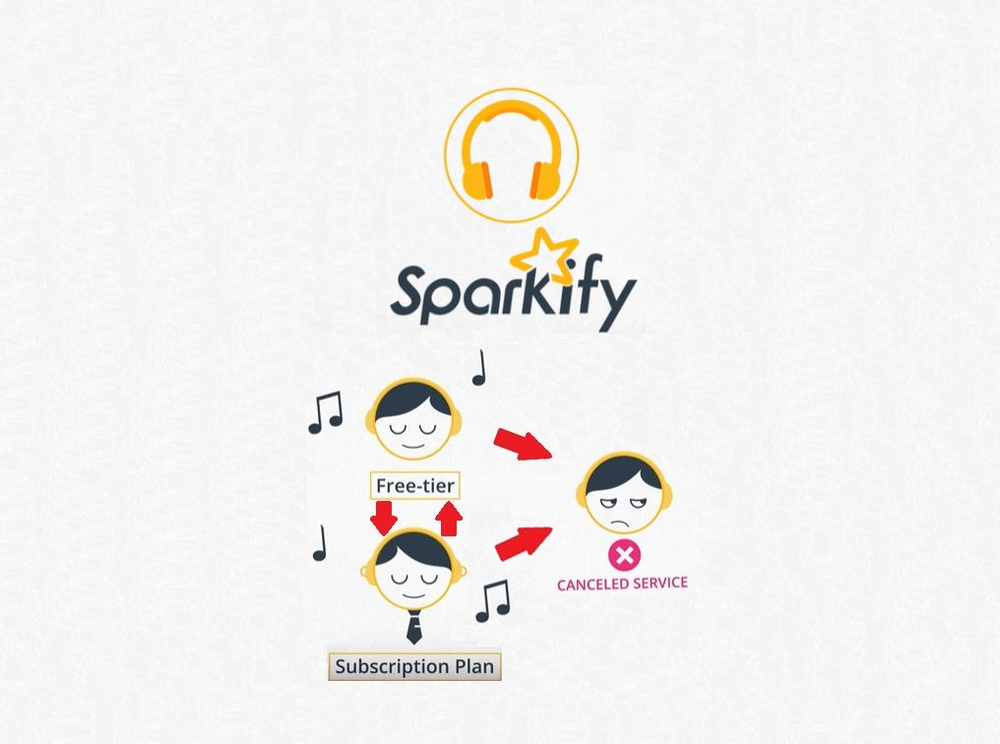

# Data Scientist Capstone Project

## Introduction

This project is part of The [Udacity](https://eu.udacity.com/) Data Scientist Nanodegree Program which is composed by:
* Term 1
    * Supervised Learning
    * Deep Learning
    * Unsupervised Learning
* Term 2
    * Write A Data Science Blog Post
    * Disaster Response Pipelines
    * Recommendation Engines

The goal of this project is to put in practice the skills taught during all the nanodegree plus the extracurricular course dedicated to [Spark](https://spark.apache.org/). Apache Spark is a unified analytics engine for big data processing, with built-in modules for streaming, SQL, machine learning and graph processing.
The specific aim is to predict if a user is going to churn from the fictional digital music service called Sparkify. Users can listen to music for free by also listening to some advertisement in between the songs or by paying a monthly subscription fee to have an ads free experience. In any time the users can decide to downgrade from premium to free, upgrade from free to premium or to cancel from the service.

## Software and Libraries
This project uses Python 3.7.2 and the following libraries:
* [NumPy](http://www.numpy.org/)
* [Pandas](http://pandas.pydata.org)
* [pyspark](https://spark.apache.org/docs/latest/api/python/index.html)
* [Matplotlib](http://matplotlib.org/)
* [seaborn](https://seaborn.pydata.org/)

## Data
The dataset provided is pretty big (12GB) and is basically composed by the log of each user action on the platform. A smaller subset (128MB) is also provided for approaching the problem:
* **mini_sparkify_event_data.json**: Subset
* **sparkify_event_data.json**: Full dataset

## Running the code

The code is provided in the [Jupyter Notebook](http://ipython.org/notebook.html) _sparkify.ipynb_
If you donwload it simply run the command `jupyter notebook sparkify.ipynb` in the folder were the file is located.

## Results

Results are better explained in this [blog post](https://medium.com/@simone.rigoni01)

## Licensing and Acknowledgements

Thank you [Udacity](https://eu.udacity.com/) for the datasets and for the awesome journey that this Data Scientist Nanodegree has been.
