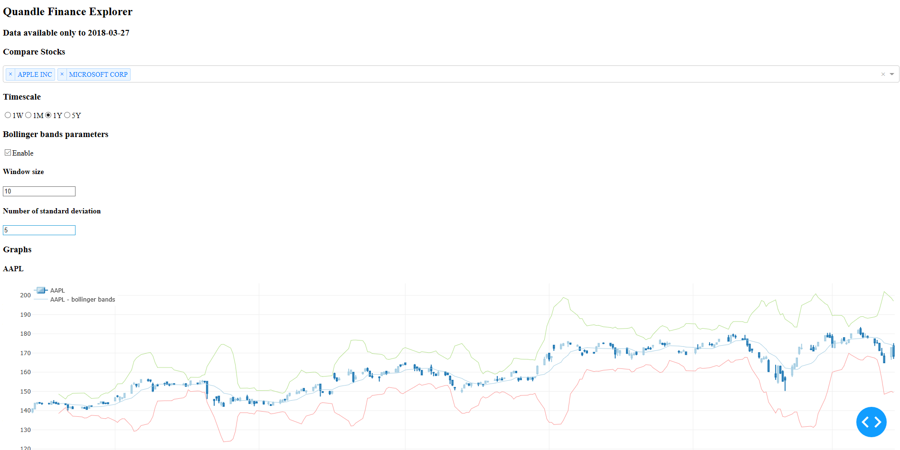

# Portfolio Exercise: Deploy a Data Dashboard

## Introduction

This project is part of The [Udacity](https://eu.udacity.com/) Data Scientist Nanodegree Program which is composed by:
* Term 1
    * Supervised Learning
    * Deep Learning
    * Unsupervised Learning
* Term 2
    * Write A Data Science Blog Post
    * Disaster Response Pipelines
    * Recommendation Engines
    
The goal of this project is to develop and deploy a data dashboard to put in practice the concepts explained in the lessons:
1. Wrangling your chosen data set to get the data in the format you want
2. Writing Python code to read in the data set and set up Plotly plots
3. Tweaking HTML so that the website has the design and information that you want

## Software and Libraries

This project uses Python 3.8.2 and the following libraries:
* [NumPy](http://www.numpy.org/)
* [dash](https://plot.ly/dash/)
- [django](https://www.djangoproject.com/)
- [django-plotly-dash](https://pypi.org/project/django-plotly-dash/)
* [Pandas](http://pandas.pydata.org)
- [Quandl](https://pypi.org/project/Quandl/)

More info in `requirements.txt`

## Data

[Quandl](https://www.quandl.com/) let you access to data for free until 2018-03-27

## Running the code

From the project folder run `python finance_data_dashboard.py` to start the dash application. The default url to connect to it is http://127.0.0.1:8050/
The applicaation can be run stand alone or within a django web site using **django_plotly_dash**
To work you have to provide your own **QUANDL_PERSONAL_KEY**

## Results

The dash application 

In the top part is possible to select wich stocks you want to compare, the time scale and the parameters for the [bollinger bands](https://en.wikipedia.org/wiki/Bollinger_Bands)

In the bottom part we can see the graphs of the stocks we have selected and we can choose to see different indicators with a dropbox menu

## Licensing and Acknowledgements
Thanks to [Quandl](https://www.quandl.com/) for the datasets and more information about the licensing of the data can be find [here](https://www.quandl.com/databases/WIKIP/documentation)

